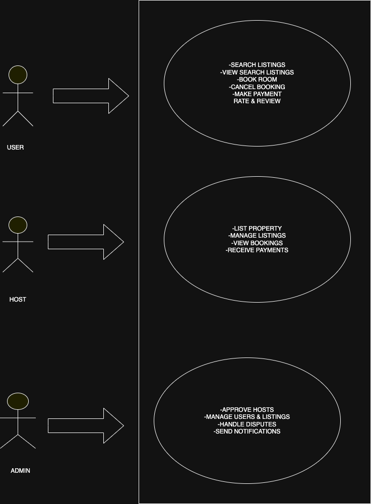

# Requirement Analysis in Software Development.
## What is Requirement Analysis?

Requirement Analysis is a critical phase in the Software Development Lifecycle (SDLC) where the needs and expectations of stakeholders are gathered, understood, documented, and validated. It forms the foundation for designing and developing a successful software product.

The requirements typically include:

- **Functional Requirements:** Specific behaviors or functions the system must perform (e.g., user authentication, data processing).
- **Non-Functional Requirements:** Constraints or qualities such as performance, security, usability, and scalability.
- **Business Requirements:** High-level goals and objectives the software must fulfill.
- **User Requirements:** How end-users expect to interact with the system.

---

## Why is Requirement Analysis Important?

1. **Foundation for Development**  
   Provides a clear roadmap that guides developers and designers, helping prevent scope creep and ensuring the product meets user needs.

2. **Improves Communication**  
   Creates a shared understanding among clients, developers, testers, and project managers, reducing ambiguity and misunderstandings.

3. **Reduces Risk and Costs**  
   Early identification of issues prevents costly rework during later stages.

4. **Facilitates Project Planning**  
   Helps estimate costs, resources, timelines, and technology needs accurately.

5. **Ensures Quality and User Satisfaction**  
   Aligns product features with user expectations and business goals.

6. **Serves as a Basis for Testing**  
   Requirements provide the criteria for creating test cases to verify and validate the software.

---

## Summary

Requirement Analysis translates vague ideas into concrete specifications, ensuring the final product is useful, usable, and aligns with business objectives. Skipping or poorly conducting this phase can lead to project failure, wasted resources, and dissatisfied users.

---

*If interested, I can also add common techniques and tools used for requirement analysis.*

## Key Activities in Requirement Analysis

- **Requirement Gathering**  
  Collecting information from all stakeholders, including users, clients, and business experts, to understand their needs and expectations.

- **Requirement Elicitation**  
  Engaging stakeholders through interviews, workshops, questionnaires, and observations to uncover implicit and explicit requirements.

- **Requirement Documentation**  
  Organizing and recording the gathered requirements clearly and comprehensively, often using requirement specification documents or user stories.

- **Requirement Analysis and Modeling**  
  Examining requirements to identify conflicts, overlaps, and feasibility. Using models like use case diagrams, data flow diagrams, or UML to represent requirements visually.

- **Requirement Validation**  
  Ensuring the documented requirements accurately reflect stakeholder needs through reviews, walkthroughs, and approvals before development begins.
## Types of Requirements

### Functional Requirements

Functional requirements describe what the system **should do** — the specific behaviors or functions the software must perform.

**Examples for a Booking Management Project:**  
- Users can search for hotels by location, dates, and price range.  
- The system allows users to book, modify, or cancel reservations.  
- Payment processing through multiple payment gateways (credit card, PayPal).  
- User registration and authentication (signup, login, password reset).  
- Sending booking confirmation emails and notifications.  
- Admin can manage hotel listings, availability, and pricing.

---

### Non-functional Requirements

Non-functional requirements specify **how the system performs** certain functions — focusing on quality attributes, constraints, and system behavior.

**Examples for a Booking Management Project:**  
- The system must handle 10,000 concurrent users with less than 2-second response time.  
- Data must be encrypted both in transit and at rest to ensure security.  
- The application should be available 99.9% of the time (high availability).  
- The system should support multiple languages and currencies.  
- The user interface must be responsive and accessible on both desktop and mobile devices.  
- Compliance with GDPR and other relevant data privacy regulations.

---

These two categories ensure the software not only works correctly but also meets user expectations for performance, security, and usability.

# 📚 Use Case Diagrams

## What is a Use Case Diagram?

A **Use Case Diagram** is part of the Unified Modeling Language (UML) that visually represents the interactions between **actors** (users or systems) and the **system** itself. It helps outline the system's functionality in terms of **who** does **what**.

---

## ✅ Benefits of Use Case Diagrams

- Helps define **system boundaries**.
- Clarifies **user interactions** with the system.
- Enhances communication between **developers, stakeholders, and clients**.
- Supports **requirement validation** in the early stages of development.
- Provides a **clear visual summary** of key system functions.

---

## 🏨 Use Case Diagram for the Hotel Booking System

### 👥 Actors

- **User** – can search, book, pay for, and review listings.
- **Host** – can list, manage, and monitor bookings for properties.
- **Admin** – manages users, listings, and resolves disputes.

### 📌 Use Cases

#### For Users:
- Search Listings  
- View Listing Details  
- Book Room  
- Cancel Booking  
- Make Payment  
- Rate & Review  

#### For Hosts:
- List Property  
- Manage Listings  
- View Bookings  
- Receive Payments  

#### For Admins:
- Approve Hosts  
- Manage Users & Listings  
- Handle Disputes  
- Send Notifications  

---

## 🖼️ Use Case Diagram

